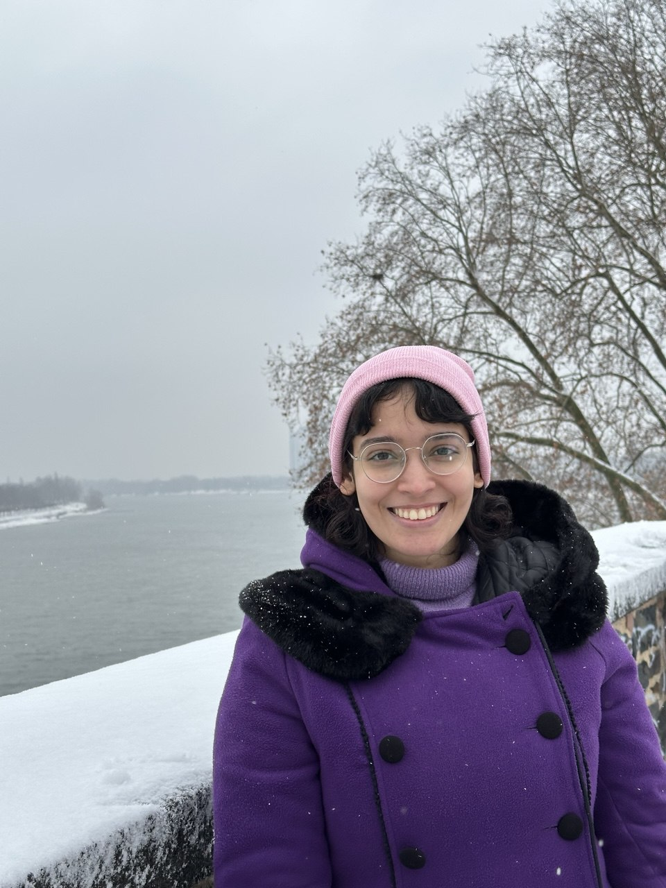

# Hello, I'm Toka! 👋

  

    

      I am currently doing my PhD in Astrophysics at the Argelander-Institut für Astronomie, University of Bonn. 
      I am also a member of the <a href="https://blog.mpifr-bonn.mpg.de/imprs/">IMPRS for Astronomy & Astrophysics</a>, 
      and the Bonn-Cologne Graduate School for Physics and Astronomy (<a href="https://www.gradschool.physics.uni-bonn.de/">BCGS</a>). My research is funded by the <a href="https://dynaverse.astro.uni-koeln.de/">DFG excellence cluster "Our Dynamic Universe"</a>.
    

    

      My research focuses on leveraging machine learning methods to do Cosmology with the large-scale structure. 
      I am particularly interested in structure formation and new methods to constrain Primordial non-Gaussianity, 
      as well as new statistical inference methods.
    

  

  

    
  

---

<a href="CV_Dec_2025-Alokda_Toka.pdf" target="_blank">Find my CV here</a>

---

## Publications

*Submitted*

**[Coverage is not enough: Frequentist tests of simulation-based inference for primordial non-Gaussianity](https://arxiv.org/abs/2605.00980)**
*Toka Alokda*, Alexander Eggemeier, and Cristiano Porciani arXiv:2605.00980

*Published*

**[Segmenting proto-halos with vision transformers](https://iopscience.iop.org/article/10.1088/1475-7516/2025/11/083)**  
*Toka Alokda* and Cristiano Porciani JCAP11(2025)083

[*Click here for a ~20 minute Talk summarizing this work*](https://videos.univ-grenoble-alpes.fr/video/33651-2025_07_24_16_11_toka-alokda/)

---

## Contact

*email:* toka(at)uni-bonn.de

[BlueSky](https://bsky.app/profile/astrotoka.bsky.social) | [LinkedIn](https://www.linkedin.com/in/tokaalokda) | [Github](https://github.com/tokaalokda) | [personal blog for thoughts and poetry](https://singularit.home.blog/)
