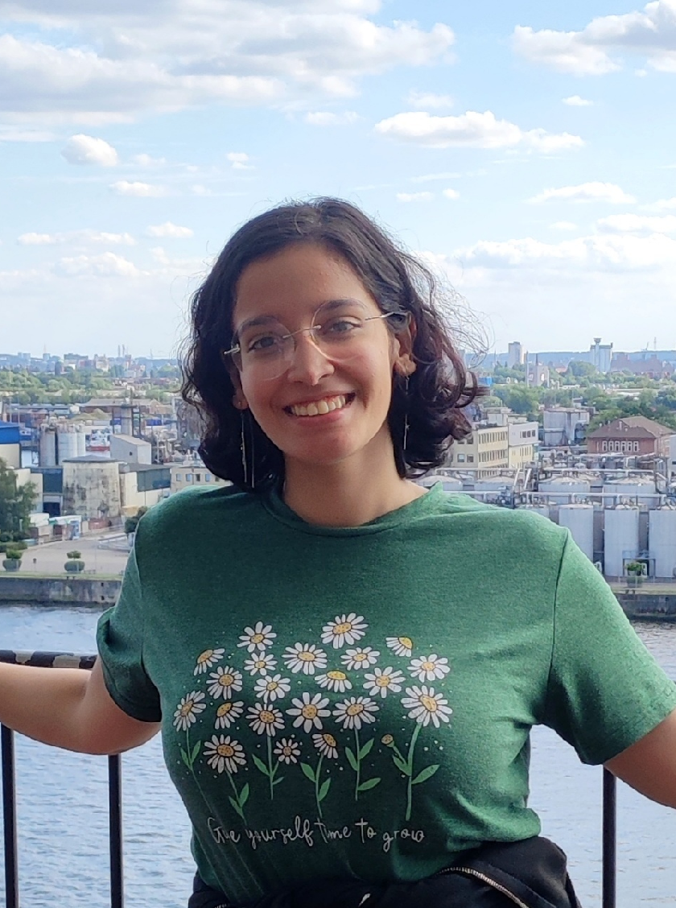

# Hello, I'm Toka!

  

I am currently doing my PhD in Astrophysics at the Argelander-Institut für Astronomie, University of Bonn. I am also a member of the IMPRS for Astronomy & Astrophysics, and the Bonn-Cologne Graduate School for Physics and Astronomy (BCGS).

My research focuses on levraging machine learning methods to do Cosmology with the large-scale structure.

---

## Publications

*submitted to JCAP and under review*

**[Segmenting proto-halos with vision transformers](https://arxiv.org/abs/2508.00049)**  
*Toka Alokda*, Cristiano Porciani. arXiv:2508.00049 (2025)

[*Click here for a ~20 minute Talk summarizing this work*](https://videos.univ-grenoble-alpes.fr/video/33651-2025_07_24_16_11_toka-alokda/)

---

## Contact

*email:* toka(at)uni-bonn.de

[BlueSky](https://bsky.app/profile/astrotoka.bsky.social) | [LinkedIn](https://www.linkedin.com/in/tokaalokda) | [Github](https://github.com/tokaalokda)
