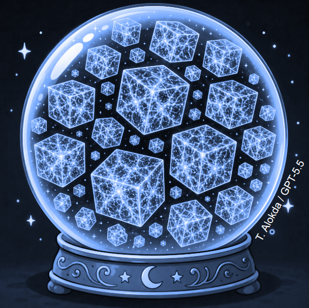
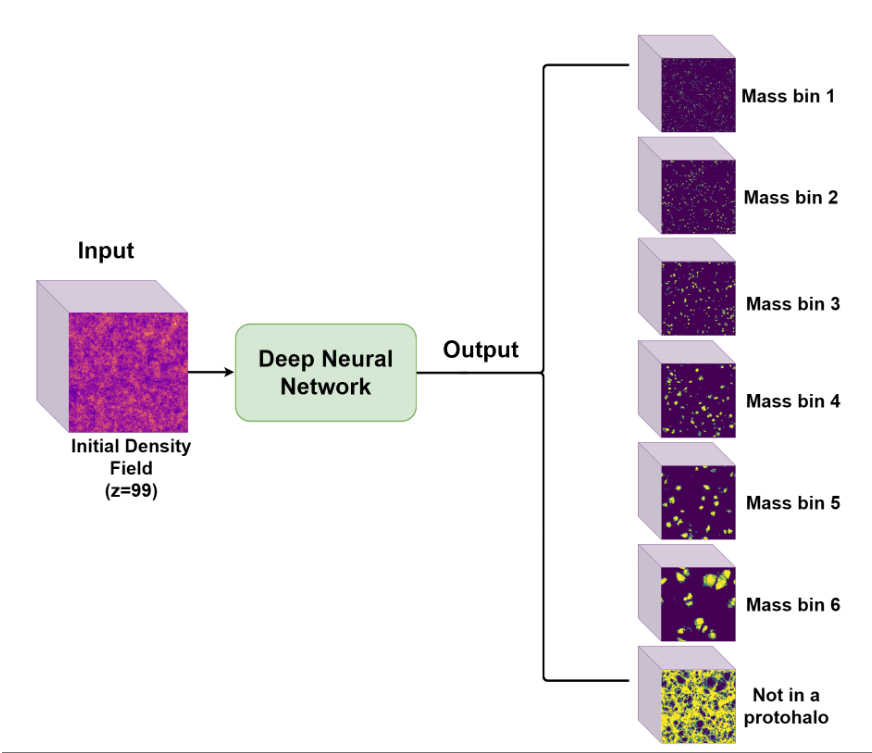

  <a href="/">Home</a> &nbsp;|&nbsp; 
  <a href="/research.html">Research</a> &nbsp;|&nbsp; 
  <a href="/publications.html">Publications</a> &nbsp;|&nbsp; 
  <a href="/CV_July_2026-Alokda_Toka (1).pdf" target="_blank">CV</a> &nbsp;|&nbsp; 
  <a href="/about.html">About Me</a>

  🚧 This page is still under construction 🚧

---

## Bridging the Early and Late Universe with Simulations and Machine Learning

### 1. Constraining Primordial Non-Gaussianity from the Large-Scale Structure
Primordial non-Gaussianity (PNG) offers a unique window into the physics of the very early Universe and the mechanics of cosmic inflation. Constraining PNG is a critical goal in modern cosmology, and the Large-Scale Structure (LSS) provides a powerful, three-dimensional canvas to achieve this. However, traditional methods for analyzing the LSS, such as $N$-point statistics, often suffer from the curse of dimensionality. 

My research focuses on developing novel summary statistics that surpass these traditional limitations, alongside building reliable and efficient Simulation-Based Inference (SBI) pipelines. A fundamental challenge in cosmology is cosmic variance: while we can simulate countless universe realizations with different cosmologies, we only have one Universe to observe. In my most recent work, we addressed the challenges of this limitation by exploring the robustness of neural SBI to sample noise, utilizing thousands of simulated universes at a fixed cosmology to ensure our inference pipelines are both accurate and resilient.

  

### 2. Cosmological Structure Formation
One of the most complex questions in cosmology is understanding the highly non-linear relationship between initial density fluctuations and the formation of dark matter halos. Using deep learning methods, I investigate this connection by predicting the positions and masses of proto-halo patches that eventually collapse into dark matter halos directly from $N$-body initial conditions. 

Beyond simply achieving high predictive accuracy, I am deeply interested in the interpretability of these deep learning models within the framework of established physical theories. What are the deciding factors and primary physical influences driving halo formation? By answering these questions, we can bridge the gap between black-box algorithms and theoretical physics, utilizing this new technology to generate the fast, reliable mock catalogs that are essential for next-generation cosmological surveys.

  

---

## Decoding Messages from our Galactic Center with Theoretical Particle Physics

Beyond the large-scale structure, my earlier research investigated anomalies in cosmic ray measurements—specifically the enigmatic excess in galactic positron flux observed by the AMS-02 experiment. To interpret these high-energy signals, I modeled a TeV-scale scalar Weakly Interacting Massive Particle (WIMP) dark matter candidate. 

A major challenge in dark matter phenomenology is reconciling an annihilation rate high enough to produce the observed positron excess today with the rate required in the early Universe to preserve the correct dark matter relic density. To bridge this gap, my work incorporated the **Sommerfeld enhancement**—a quantum mechanical effect that significantly boosts the dark matter annihilation cross-section at the low velocities found in our present-day galactic halo, while leaving the early-universe annihilation rate safely unchanged. This research highlighted how theoretical particle physics can provide elegant, velocity-dependent mechanisms to explain localized cosmic ray anomalies without violating standard cosmological constraints.
